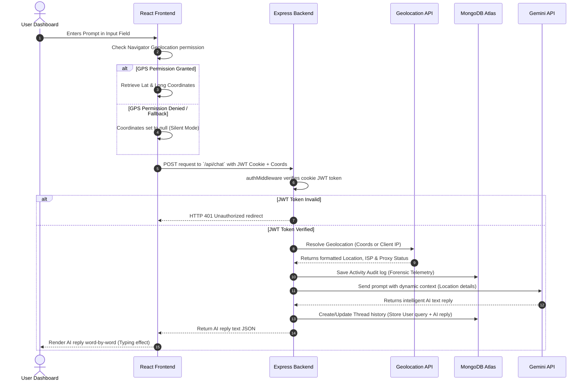
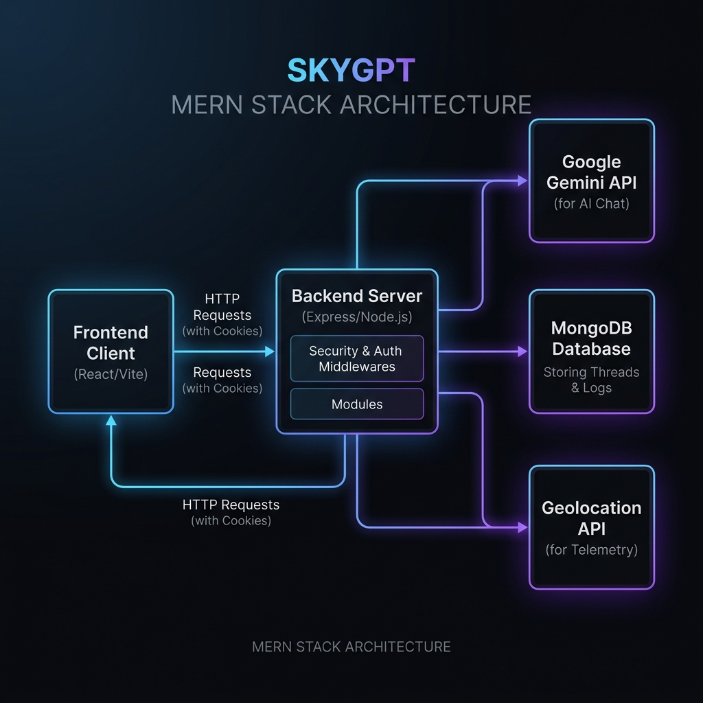
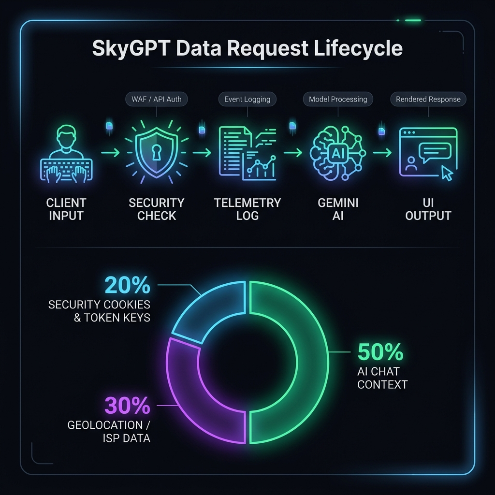

# SkyGPT Deployment, Architecture & Rebuilding Guide

Guide yeh clear karta hai ki **SkyGPT (MERN Stack)** application ko run karne ke liye Localhost aur Public Host me kaun-kaun si files lagti hain, unka functions kya hai, aur agar is project ko scratch se dubara banana ho to kya architecture aur workflow follow karna chahiye.

---

## 🍽️ The Restaurant Analogy (Working Principle)
MERN Stack app ko samajhne ke liye ek premium modern restaurant ka example lete hain:

| Component | Role in Restaurant | Technical Role in SkyGPT |
| :--- | :--- | :--- |
| **Frontend (React)** | Dining Area & Customer Menu | Client-side UI where user chats and logs in. |
| **Backend (Express)** | Kitchen & Chef | Server that validates cookies, routes requests, grabs geo IP. |
| **Database (MongoDB)** | Storage Pantry / Cold Room | Stores users, chat history, and security audit logs. |
| **Gemini API (AI)** | Specialized Sub-Contractor Chef | Generates intelligent replies for the chat window. |
| **.env File** | Secret Recipe Book & Passwords | Holds API Keys, DB Passwords, and backend ports. |

*   **Vite Development Server (Localhost):** Yeh chef ke ghar ki temporary cooking stove hai jahan testing hoti hai.
*   **Vercel / Render (Public Host):** Yeh commercial kitchen space hai jahan customers real-world me aate hain (Internet access).
*   **`vercel.json` (Vercel blueprint):** Kitchen manager ke rules jo batate hain ki customer agar galat table number (invalid route) par baithe, to use receptionist menu table (SPA Index file) par kaise bhejaye.

---

## 📂 File Hierarchy & Folder Structure

SkyGPT ka clean, square-hierarchical code structure:

```
e:\SkyGPT_old\ (Root Workspace Directory)
├── 📄 skygpt_architecture_flow.png   <-- High-Resolution Architecture Flow Chart
├── 📄 Hosting_And_Architecture_Guide.md  <-- This Document
├── 📁 Backend/                         <-- Backend Server (Express & Node)
│   ├── 📄 server.js                    <-- Server Core & Middleware Config
│   ├── 📄 package.json                 <-- Dependencies & Run Scripts
│   ├── 📄 package-lock.json            <-- Locked exact versions of modules
│   ├── 📄 .env                         <-- Database keys, JWT secret, Gemini key
│   ├── 📄 admin_report.js              <-- CLI Admin Tool for audits (Optional)
│   ├── 📁 auth/                        <-- Isolated Security & Authentication
│   │   ├── 📁 config/                  <-- OAuth keys & settings
│   │   ├── 📁 controllers/             <-- Register/Login/Logout handlers
│   │   ├── 📁 middlewares/             <-- JWT checks, XSS clean, rate limiters
│   │   ├── 📁 routes/                  <-- Authentication routes (`/api/auth/*`)
│   │   ├── 📁 services/                <-- Email sending & DB creation service
│   │   └── 📁 utils/                   <-- JWT token generators
│   ├── 📁 models/                      <-- MongoDB Schema definitions
│   │   ├── 📄 User.js                  <-- User Credentials Schema
│   │   ├── 📄 Thread.js                <-- Chat Session & Telemetry data Schema
│   │   └── 📄 ActivityLog.js           <-- Forensic Evidence Logs Schema
│   ├── 📁 routes/                      <-- Core Functional Routes
│   │   └── 📄 chat.js                  <-- Gemini, GPS coordinates & logs
│   └── 📁 utils/                       <-- Helper services
│       ├── 📄 gemini.js                <-- Google Gemini Prompt connector
│       ├── 📄 geo.js                   <-- IP-to-ISP & Reverse Geocoding
│       └── 📄 emailService.js          <-- Verification / Reset Email SMTP
└── 📁 Frontend/                        <-- Frontend UI (React & Vite)
    ├── 📄 package.json                 <-- UI dependencies & Build scripts
    ├── 📄 vite.config.js               <-- Dev server proxy settings
    ├── 📄 vercel.json                  <-- Production SPA redirection configuration
    ├── 📄 index.html                   <-- Root DOM page shell
    ├── 📄 .env                         <-- Live URL pointer configuration
    ├── 📁 public/                      <-- Static public-facing folder
    │   ├── 📄 blacklogo.png            <-- App logo image (Active)
    │   └── 📄 vite.svg                 <-- Tab favicon icon
    └── 📁 src/                         <-- React Components codebase
        ├── 📄 main.jsx                 <-- React mounting point
        ├── 📄 index.css                <-- Global styling rules
        ├── 📄 App.jsx                  <-- Routing stack & Context wrappers
        ├── 📄 App.css                  <-- Main page grid styling
        ├── 📄 ChatWindow.jsx           <-- Telemetry collector & Send prompts
        ├── 📄 ChatWindow.css           <-- Splendid Chat window aesthetics
        ├── 📄 Chat.jsx                 <-- Word-by-word AI typing component
        ├── 📄 Chat.css                 <-- Markdown rendering styles
        ├── 📄 Sidebar.jsx              <-- Saved history threads & delete triggers
        ├── 📄 Sidebar.css              <-- Slide-in responsive menu styles
        ├── 📄 MyContext.jsx            <-- Global context definitions
        ├── 📁 services/                <-- Frontend API queries
        │   └── 📄 authApi.js           <-- AXIOS/Fetch calls for Auth controllers
        └── 📁 auth/                    <-- User access security guards
            ├── 📄 AuthProvider.jsx     <-- Session persistence provider
            ├── 📄 ProtectedRoute.jsx   <-- Block dashboard from guests
            ├── 📄 Login.jsx            <-- Premium Saberali Split-Screen page
            ├── 📄 Signup.jsx           <-- High-End registration page
            ├── 📄 ForgotPassword.jsx   <-- Forgot password flow
            └── 📄 ResetPassword.jsx    <-- Reset link validator form
```

---

## 🛠️ Localhost vs. Public Host Requirement

### 💻 Localhost (Development Setup)
Apne personal computer par local code execute karne ke liye sabhi source files required hoti hain:

1.  **Backend source files:** Sabhi files `Backend/` folder ke andar.
2.  **Frontend source files:** `Frontend/src/` aur `Frontend/public/` directory ke documents.
3.  **Local Environment Config (`Backend/.env`):**
    ```env
    PORT=8080
    MONGODB_URI=mongodb://localhost:27017/skygpt   # (Or a cloud test DB)
    FRONTEND_URL=http://localhost:5173
    JWT_SECRET=supersecretlocaltokenkey
    GEMINI_API_KEY=AIzaSyYourGeminiApiKeyHere
    ```
4.  **Local Environment Config (`Frontend/.env`):**
    ```env
    VITE_API_BASE_URL=http://localhost:8080
    ```
5.  **`node_modules/` (Local Installation):** Local execution ke liye `npm install` run karke dependencies generate ki jaati hain.

---

### 🌐 Public Host (Production Server)
Jab aap application ko production me deploy karte hain (jaise Render backend par aur Vercel frontend par), to structure me niche diye gaye changes aate hain:

1.  **`node_modules/` and `dist/` folders are ignored:** In folders ko GitHub par upload nahi kiya jata. Production platforms dependencies ko `package.json` file dekhkar server par direct install (`npm install`) karte hain aur code build karte hain.
2.  **Environment Variables directly from Hosting Panels:**
    *   Production deployment me `.env` files upload nahi hoti. Dashboard settings (jaise Render/Vercel settings) me API keys safe config hoti hain.
    *   **Live Backend Environment Settings (Render Dashboard):**
        *   `MONGODB_URI` = MongoDB Atlas Cloud link.
        *   `FRONTEND_URL` = Live Vercel web address (e.g. `https://skygpt.vercel.app`).
    *   **Live Frontend Environment Settings (Vercel Dashboard):**
        *   `VITE_API_BASE_URL` = Live Render backend api link (e.g. `https://skygpt-backend.onrender.com`).
3.  **`Frontend/vercel.json` is mandatory:** Vercel server routes handle karne ke liye static routing support deta hai. Yeh file user ke routing request ko client framework (`App.jsx`) par correctly forward karti hai.

---

## 📊 SkyGPT MERN Telemetry Flow (Mermaid)

Niche diya diagram user, auth verification, geolocation detection aur Gemini response generation ke continuous flow ko represent karta hai:



---



---

## 📊 Simplified Data Breakdown & Request Lifecycle

Niche diya infographics diagram project ke core data flow aur request structure ko explain karta hai (Donut chart representation for request data packet composition and lifecycle steps):



---

## 🏗️ Step-by-Step Rebuilding Roadmap (Scratch se kaise banayein)

Agar aapko is project ko dubara build karna ho, to aapko niche diye steps follow karne chahiye:

### 📍 Step 1: Project Structure setup & Config
1. Root directory configure karein aur `Backend` aur `Frontend` ke separate folders banayein.
2. Dono me `npm init -y` initialize karein dependencies control karne ke liye.
3. Backend me Express, Mongoose, CORS, Cookie-parser, dotenv aur JWT configure karein.
4. Frontend me Vite ke sath React core structure configure karein.

### 📍 Step 2: Database Models & Security Logs
1. MongoDB Schema tayar karein:
   * **User Schema:** Username, email (verified status), hashed password, avatar aur login provider (Local, Google, GitHub).
   * **Thread Schema:** User id, chat session id, chat details, telemetric details (IP address, location coordinates, ISP, browser user agent, device id, aur vpn status).
   * **Activity Log Schema:** Audit log table jo har action (auth, security bypass, AI search queries) ko timestamp ke sath target karti hai.

### 📍 Step 3: Security & Custom Authentication
1. Session management ke liye HttpOnly cookies me encrypted JWT tokens configure karein.
2. Sign-in, sign-up, verification email links (nodemailer ke sath verification token DB entry) implement karein.
3. Forgot/Reset Password control controllers setup karein.
4. Helmet headers security aur Rate Limiters add karein taaki brute force attacks ko prevent kiya ja sake.

### 📍 Step 4: Core Logic Integration (AI & Telemetry)
1. Backend utils me IP dynamic location fetch karne ke liye standard external database APIs (`ipinfo.io` ya `ip-api`) connect karein.
2. Google Gemini SDK install karke config setup karein, aur location context system parameters prompt me push karne ka wrapper design karein.
3. Chat APIs setup karein jo context, token verification, telemetry logs generation aur Gemini communication handle karti ho.

### 📍 Step 5: Frontend Dashboard & Context
1. User authorization check ke liye standard `ProtectedRoute` context container setup karein.
2. CSS Glassmorphism effects ke sath beautiful sidebars aur real-time typing animation features design karein.
3. Split-screen layout me modern Login/Signup user interfaces standard styles ke sath apply karein.

---

> [!TIP]
> **Production Success Tip:** Live deployment ke time ensure karein ki aapka frontend domain (Vercel) Backend ke `cors` headers configuration ke white-list array (`process.env.FRONTEND_URL`) me mandatory match karta ho, aur credentials true configuration correct set ho taaki cookies exchange standard rules follow karein.
