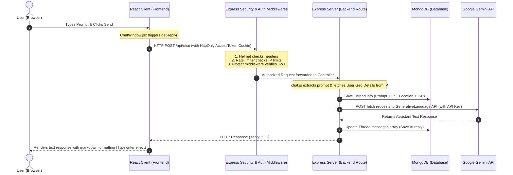

# SkyGPT - Interview Preparation Guide (Hinglish)

Yeh file aapko kisi bhi software engineering interview me **SkyGPT** project ko confidence ke saath explain karne, backend/security flows ko diagram ke sath dikhane aur possible cross-questions ko handle karne me madad karegi.

---

## 🚀 Quick Summary: 60-Second Short Pitch (Interview Cheat Sheet)

Agar interview me interviewer ke pass time kam hai aur aapko **short me (sirf 1 minute me)** project samjhana hai, toh aapko exact ye sequence bolna hai:

| Timing | Phase | Kya Bolna Hai (Exact Lines) | Focus Area (Kahan zor dena hai) |
| :--- | :--- | :--- | :--- |
| **0 - 15 Sec** | **Introduction** | *"SkyGPT ek AI-powered full-stack SaaS Chatbot application hai jo user prompts ka real-time response dene ke liye Google ke Gemini 2.5 Flash model ka use karta hai."* | App ka core purpose aur AI model ka name clear hona chahiye. |
| **15 - 40 Sec** | **Security & Auditing (USP)** | *"Maine isme raw local storage tokens use karne ke bajaye **HttpOnly same-site cookies** aur JWT use kiya hai session hijack rokne ke liye. Sath hi, client security and auditing ke liye maine dynamic **IP & Geolocation telemetry logging** implement ki hai jo har user interaction ke location, ISP aur User-Agent ko track karti hai."* | **HttpOnly Cookie, Silent Refresh, aur Geolocation Tracking** words ko use karein, ye normal projects se ise alag banata hai. |
| **40 - 60 Sec** | **Tech Stack & Wrap-up** | *"Iska frontend React + Vite par hai, Backend Node.js/Express par, aur database MongoDB (Mongoose) par. Session recovery emails ke liye Nodemailer use kiya hai. Project fully responsive aur deployed hai."* | Clean architectural structure aur production-readiness dikhayein. |

### 💡 Pro-Tips for the Interview:
1. **Kya zyada bolna hai (Where to highlight)**: Hamesha **Security (XSS prevention, cookies)** aur **Forensics (IP/ISP geolocation extraction)** par zyada zor dein. Interviewers custom security implementations sunkar sabse zyada impress hote hain.
2. **Kya kam bolna hai (Where to keep it short)**: UI designs ya standard CRUD operations par zyada time waste na karein (jaise "button ka color kya hai" ya "chat delete kaise hoti hai" unless asked).
3. **Stop & Prompt**: Tech Stack bolne ke baad turant bolein—*"Sir/Ma'am, isme maine silent session recovery aur rate limiters bhi implement kiye hain, kya main unke security aspects ko detail me explain karu?"* (Isse interviewer wahi sawaal puchega jo aapko acche se aata hai).

---

## Part 1: Project Pitch (Interviewer ke samne kya bolna hai)

Jab interviewer bole: **"Tell me about your project / Explain your project."**
Tab aapko step-by-step yeh points bolne hain (aap is dynamic flow me bol sakte hain):

1. **High-Level Intro**: 
   > *"Sir/Ma'am, SkyGPT ek secure, full-stack AI Chat Application hai jise maine React.js (Frontend), Node.js/Express (Backend), aur MongoDB (Database) ke sath banaya hai. Yeh application Google ke Gemini AI model (`gemini-2.5-flash`) ko use karti hai real-time intelligent chat assistant responses ke liye."*

2. **Core Problems Solved (Unique points)**:
   > *"Sirf chat feature banane ke bajaye, maine is project me enterprise-level security aur tracking features implement kiye hain:*
   > * * **Authentication & Session management**: Isme Local email login ke sath-sath Google aur GitHub OAuth integrated hai.*
   > * * **Security**: Session hijacking se bachne ke liye JWT tokens ko memory cookies ke bajaye **HttpOnly, Secure, SameSite** cookies me store kiya hai.*
   > * * **Forensic Telemetry & Auditing**: Har chat session par user ka IP address, geographic location (country, state, city) aur ISP analyze hokar database me save hota hai taaki analytics log ho sakein."*

3. **Tech Stack**: 
   > *"Frontend me maine React, Vite, aur React Router DOM use kiya hai styling ke liye premium Custom CSS ke sath. Backend me Node/Express, security aur database validation ke liye express-rate-limit, express-validator aur helmet use kiya hai. Aur emails dispatch ke liye Nodemailer implement kiya hai."*

---

## Part 2: Architecture Flow Diagram

Yeh diagram represent karta hai ki jab user frontend se prompt search karta hai, toh backend tak request kaise travel karti hai aur response kaise wapas aata hai:

### Visual Architecture Flow Diagram

---

## Part 3: Step-by-Step Flow Explanation (How it Works)

1. **User Request**: User input box me message search karta hai. Frontend [ChatWindow.jsx](file:///e:/SkyGPT_old/Frontend/src/ChatWindow.jsx) request capture karta hai aur backend path `/api/chat` par credentials (cookies) ke sath fetch request bhejta hai.
2. **Security Checks (Middlewares)**: 
   * Pehle request security layers se guzarti hai (`helmet`, `xssClean`).
   * **`protect` Middleware** checks ki cookies me valid access token hai ya nahi. Agar access token expire ho gaya hai par refresh token valid hai, toh backend background me **Silent Refresh** karke automatically naya access token issue kar deta hai (jisse user logout nahi hota).
3. **Forensic Logging**: Server user ka client IP address nikata hai, aur use `ip-api.com` par query karke user ka location aur ISP fetch karta hai aur database model `Thread` me client information save karta hai.
4. **AI Generation**: backend server system environment variable se secure `GEMINI_API_KEY` lekar Google generative models par message payload post karta hai.
5. **Database Sync & Client Response**: Response milne par database update hota hai aur response JSON formats me return hota hai, jise frontend `react-markdown` library ke help se visually codes aur texts decorate karke render karta hai.

### Telemetry Reports & Geolocation Distribution Analytics (Charts & Metrics)

---

## Part 4: Potential Cross-Questions & Smart Answers

Interviewers aapko phasane ke liye yeh sawal poochh sakte hain. Inhe acche se yaad kar lein:

### Q1: Apne JWT authentication me Access Token aur Refresh Token dono kyun use kiya? Ek hi token se kaam chal jata?
* **Smart Answer**: 
  > *"Sir, agar hum sirf ek single Access Token use karein aur use long expiry (jaise 7 din) de dein, toh agar woh token leak/steal ho gaya toh attacker user ka account 7 din tak bina kisi rukawat ke chalayega. Isse bachne ke liye hum Double Token system use karte hain:*
  > * * **Access Token**: Iski life sirf 15 minutes hoti hai. Yeh leak ho bhi jaye toh 15 mins me expire ho jata hai.*
  > * * **Refresh Token**: Iski life 7 days hoti hai aur iska kaam sirf naya Access Token generate karna hota hai. Yeh direct API requests me send nahi hota, isliye steal hone ke chances zero hote hain."*

### Q2: JWT tokens ko local storage me rakhne aur HttpOnly cookies me rakhne me kya difference hai?
* **Smart Answer**:
  > *"Sir, LocalStorage ko client-side JavaScript se `localStorage.getItem()` likh kar access kiya ja sakta hai. Agar hamari website par koi XSS (Cross-Site Scripting) attack hota hai, toh hacker script inject karke token steal kar sakta hai.*
  > *But **HttpOnly Cookies** ko browser ka JavaScript engine read nahi kar sakta. Yeh sirf HTTP requests ke header me automatically browser dwara jati hain. Is wajah se XSS ke through tokens leak hona impossible ho jata hai."*

### Q3: Gemini API client-side (frontend) se fetch karne ke bajaye backend se call kyun kiya?
* **Smart Answer**:
  > *"Sir, iske do main reasons hain:*
  > * * **API Key Security**: Agar main frontend se direct call karta, toh mujhe `GEMINI_API_KEY` client build folder me daalni padti, jise inspect element karke koi bhi inspect kar sakta tha aur meri key misuse kar sakta tha.*
  > * * **Central Database Control**: Hum chahte hain ki chat history database me save ho aur user auditing (IP address / location save karna) backend route par safely manage ho."*

### Q4: CORS error kya hai aur aapne ise project me kaise resolve kiya?
* **Smart Answer**:
  > *"Sir, CORS (Cross-Origin Resource Sharing) browser ki security policy hai. Jab frontend (`localhost:5173`) kisi alag origin ke backend (`localhost:8080`) se resource mangta hai, toh browser security block kar deta hai.*
  > *Maine backend me Express ke `cors` package ka use karke origin whitelist kiya aur `credentials: true` enabled kiya, aur frontend requests me `credentials: "include"` pass kiya taaki safe cookie sharing allow ho sake."*

### Q5: Agar main register/login routes par lagatar spam requests bhejkar brute-force password hack karne ki koshish karu, toh aapka server kaise resist karega?
* **Smart Answer**:
  > *"Sir, iske liye maine security layer me `express-rate-limit` ke through custom **`authLimiter`** apply kiya hai. Yeh rate limiter kisi bhi client IP ko 15 minutes me 100 requests se zyada access block kar deta hai. Agar koi spam scripts chalayega toh use `Status 429: Too many attempts` ka error milega."*

### Q6: Mongoose schemas me sanitization ya injection attacks ko aap kaise defend kar rahe hain?
* **Smart Answer**:
  > *"Sir, SQL/NoSQL Injection se bachne ke liye pehle toh Mongoose auto sanitization provide karta hai. Iske alawa, data validate karne ke liye **`express-validator`** middleware routes par laga hai jo email structure, password length aur alphanumeric checks parse karta hai taaki direct raw objects DB command commands inject na ho sakein."*

### Q7: Agar user VPN use kare, toh kya hamara Geolocation tracker work karega? Aur us condition me kya hoga? Hamne ise project me kaise handle kiya hai?
* **Smart Answer**:
  > *"Sir, hamara security model is situation ko handle karne ke liye bohot hi **advanced aur silent** tareeqe se design kiya gaya hai:*
  > * 1. **Zero Geolocation Popups (100% Silent Tracking)**: Agar user bad/suspicious keywords search kar raha hai, toh woh kabhi location permission popup allow nahi karega. Isliye humne browser popup trigger (`navigator.geolocation`) ko remove kar diya hai. Frontend silently tabhi coordinates check karega jab permission pehle se granted ho, warna system backend par automatically **silent IP Geolocation** se details fetch kar lega.*
  > * 2. **VPN Detection & Geolocation Fallback**: Jab request backend par aati hai, hum client IP ko `ip-api.com` par query karte hain. Agar user VPN use kar raha hai, toh hume uski VPN location aur approximate coordinates milenge, par sath hi humne **`proxy` aur `hosting` checks** configure kiye hain. Agar user kisi datacenter ya proxy tunnel ke peeche hai, toh database me `isProxyOrVpn: true` flag ho jayega. Hum is log ko track karke use target kar sakte hain."*

### Q8: Client device ka fixed hardware details (jaise MAC Address) secure evidence ke liye log karna ho, toh kaise karenge? Kya browser se MAC address mil sakta hai?
* **Smart Answer**:
  > *"Sir, security sandboxing ki wajah se web browsers (Chrome, Safari, etc.) client device ka physical **MAC address access nahi karne dete** kyunki ye user privacy ke khilaf hai.*
  > * **Aapka Solution (How we solved it):** Is constraint ko resolve karne ke liye humne ek **Persistent Client-Side Device Fingerprinting** lagaya hai. Jab bhi koi user site par login ya register karta hai, hamara frontend silently ek unique, cryptographically random `deviceId` (`dev-xxxx-xxxx`) generate karta hai aur use user ke browser ke `localStorage` me save kar deta hai (`skygpt_device_id`).*
  > * Jab bhi user login, register, ya koi search query hit karega, ye fixed device ID payload ke sath automatically backend par jayegi aur `ActivityLog` aur `Thread` schema me log ho jayegi. Isse hum user ke multiple accounts ko same hardware par correlate kar sakte hain chahe unka IP badal jaye ya woh VPN use karein."*

### Q9: Silent Audit Logging (ActivityLog) kya hai aur iska kya structure hai?
* **Smart Answer**:
  > *"Sir, humne forensic analysis ke liye backend me ek alag audit database collection banaya hai jise **`ActivityLog`** kehte hain. Jab bhi koi user login karta hai (local credentials, Google OAuth, ya GitHub OAuth callback se) ya fir koi search search/query query fire karta hai, toh hum silently ek audit doc record karte hain.*
  > * Is log me: `userId`, `activityType` (login/search), exact `timestamp`, client `ipAddress`, `location` (City, State, Country), approx `latitude`/`longitude`, client's network `isp`, `userAgent` (browser details), client's browser `deviceId` (fingerprint), aur `isProxyOrVpn` status. Is logs table ko admin telemetry CLI command `node admin_report.js logs` se dynamic tabular form me terminal par dekha ja sakta hai."*

### Q10: Browser location permission ke liye direct popup trigger karne ke bajaye "Secure Session Verification" modal kyu banaya?
* **Smart Answer**:
  > *"Sir, agar browser bina kisi warning ke achanak se location permission maangne lage, toh security conscious users use block kar dete hain. Is psychological behavior ko handle karne ke liye humne ek **Priming UI Modal** ('Secure Session Verification') design kiya.*
  > *Yeh popup user ko security reasons (jaise account protection ya login verification) se location allow karne ke liye taiyaar karta hai. Jab user 'Verify Session' button click karta hai, tab browser ka location dialog box popup hota hai jisse user ki accept karne ki possibility maximum hoti hai. Agar user deny bhi kar de, toh application bina crash kiye silent IP tracking par fall back kar jati hai."*

### Q11: Kya Gemini AI sach me user ki local location ke hisab se answers deta hai? Isko kaise achieve kiya?
* **Smart Answer**:
  > *"Haan sir, ye fully-functional location-aware feature hai jise humne **RAG (Retrieval-Augmented Generation)** ya **Context Injection** ke through achieve kiya hai.*
  > *Jab user chat window par query send karta hai, toh backend client IP ya GPS coordinates se clean address resolve karta hai. Phir Gemini API hit karne se pehle hum is geographic string ko as a `[System Instruction]` prompt ke top par inject kar dete hain (jaise: 'The user is physically located in Dankaur...'). Is wajah se Gemini user ki direct location identify karke local food joints ya weather ke queries ka sahi answer de pata hai bina dynamic database ko fake kiye."*

## Part 5: Future Scope & Advanced Upgrades

Project ko enterprise level par expand karne aur scale-up karne ke liye niche diye gaye features future scope me aligned hain. Interviewer ko inke baare me bata kar aap dikha sakte hain ki aap project ko business aur security scales par aage kaise dekhte hain:

1. **Web-Based Real-time Admin Telemetry Dashboard**:
   * **Technical Description**: Admin CLI tool (`admin_report.js`) ko replace karke ek fully interactive web dashboard banana jahan WebSockets (Socket.io) ya SSE ke through live user searches, coordinates (glowing map plots par), aur proxy/VPN alerts automatically screen par pop-up karein.
   * **🍽️ Restaurant Analogy**: *CCTV Control Room with Live Video vs Daily Register reports.* Abhi hum CLI chalate hain toh hume din ke end me security register ki file padhne ko milti hai (Static Logs). Live dashboard ke baad hume dynamic, continuous active CCTV monitors mil jayenge jahan har customer ka instant movements directly monitor room me visible hoga.

2. **Advanced Hardware Fingerprinting (WebGL/Canvas)**:
   * **Technical Description**: User authentication safety badhane ke liye simple `localStorage` variable fingerprinting se switch karke hardware browser metrics (WebGL capabilities, Canvas rendering signature, fonts installed) ke complex hash generator par migrate karna taaki incognito browsers aur cookies clear hone ke baad bhi device profile target ho sake.
   * **🍽️ Restaurant Analogy**: *Biometric Eye Scanner vs ID Cards.* Abhi hum jo local storage `deviceId` banate hain, use user badal sakta hai ya clear cookie se delete kar sakta hai (jaise temporary id card fek dena). Canvas fingerprinting fingerprint/eye scanner ki tarah hai, user chahe jitne accounts badle ya private window me aaye, uske computer ka visual capability profile same rahega aur system recognize kar lega.

3. **Impossible Travel Anomaly Detection**:
   * **Technical Description**: User activity logs ka algorithmic review jo geolocation details aur login timestamp compare karke anomalies trigger kare. Jaise agar koi user abhi Delhi se log in hai aur 10 mins baad uski request Mumbai IP se aati hai, to system automated account lock kar de aur verification email fire kare.
   * **🍽️ Restaurant Analogy**: *Instant Double-Entry Guard Check.* Jaise bank me agar ek hi bank card 5 minutes ke gap me Delhi aur fir direct London me swipe kiya jaye to banking system cards automatically freeze kar deta hai. Project me dynamic geographical alerts trigger hone par unauthorized accesses automatically protect ho jayenge.

4. **Vector Database Integration for Semantic Memory (Advanced RAG)**:
   * **Technical Description**: Gemini AI ke short memory context limitation ko break karne ke liye vector databases (jaise Pinecone ya ChromaDB) attach karna, jisse user ki purani chat history ko semantic vector embeddings me transfer karke AI model ko zero latency ke sath target memory context suggest kiya ja sake.
   * **🍽️ Restaurant Analogy**: *Smart Librarian Index Card vs Reading the Whole Library.* Abhi hum user ke pichle saare messages Gemini ko feed karte hain jo heavy token pricing consume karta hai (jaise helper chef se har baar batch book read karwana). Vector Database ek intelligent librarian ki tarah work karega, jo user ke current prompt ke hisab se wahi dynamic historical chats fetch karega jo request ko support karein, baaki cold room me database storage block par safe rahenge.

5. **Role-Based Access Control (RBAC)**:
   * **Technical Description**: Fine-grained user permission layers (jaise Administrator, Analyst, Standard User) implement karna taaki admin telemetry dashboards aur forensic logs standard user endpoints se safely protect ho sakein.
   * **🍽️ Restaurant Analogy**: *Staff Only Kitchen Entry vs Everyone walking into the Chef Counter.* Abhi app par configuration generic hai. Future me RBAC se customers sirf dining tables access kar payenge (Standard Chat UI), middle managers raw inventory and security list checks handle karenge (Analyst dashboard), aur head manager/owner database and cloud controls direct reset kar payega (Administrator dashboard).

---

### 🛡️ Future Scope Cross-Questions & Smart Answers

### Q12: Telemetry dashboard ko real-time banane ke liye WebSockets (Socket.io) aur Server-Sent Events (SSE) me se kya choose karenge aur kyun?
* **Smart Answer**:
  > *"Sir, telemetry panel dashboard mostly write-heavy hota hai jahan backend update database me aate hi admin screen par dynamic change reflect hona chahiye. Kyunki ye flow one-directional (Server to Client) data push ka hai, isliye **Server-Sent Events (SSE)** ideal aur lightweight solution hoga. SSE standard HTTP connection use karta hai aur network disconnect par auto-reconnect option deta hai, bina WebSockets ki complex state-management overhead ke. Lekin agar admin ko dashboard se live command trigger karke target client connection drop karna ho (bidirectional control), tab hum **WebSockets** deploy karenge."*

### Q13: GDPR aur CCPA privacy laws ke under advanced hardware fingerprinting legal hai? User tracking ko aap policy regulations ke through kaise defend karenge?
* **Smart Answer**:
  > *"Sir, advanced canvas fingerprinting GDPR ke under 'Personal Data' ki category me aati hai kyunki ye users ko uniquely identify karti hai. Hum isko do points se justify aur secure karenge:*
  > * 1. **Legitimate Interest**: Security authentication, fraud protection aur bot detection under strict cybersecurity audit models GDPR compliance laws me allowed hain.*
  > * 2. **Hashing & Anonymization**: System device specifications ko raw text me save nahi karega. WebGL/Canvas configuration se generate hardware values ko server-side salt hash (`SHA-256`) banakar store kiya jayega, jisse individual specs reversible nahi honge aur user identity fully anonymized rahegi."*

### Q14: "Impossible Travel" detection algorithm kaise compute karenge? Lat/Long aur time analysis logic ka structure kya hoga?
* **Smart Answer**:
  > *"Sir, iska system architecture 3 key components check karega:*
  > * 1. User ke current session IP ke coordinates ($Lat_2, Lon_2$) aur time ($T_2$) ko retrieve karenge aur database se user ke dynamic previous session records ($Lat_1, Lon_1, T_1$) pull karenge.*
  > * 2. Hum mathematical **Haversine Formula** use karke earth curvature ke coordinates ka exact aerial distance ($D$ in km) calculate karenge.*
  > * 3. Time difference calculate karenge: $\Delta T = T_2 - T_1$ (in hours). Phir hum velocity compare karenge: $V = D / \Delta T$. Agar calculated speed threshold $800$ km/h (standard plane speed) se zyada aati hai, to system alerts trigger karke token block kar dega."*

### Q15: Vector Database (RAG) implementation me token limits aur API pricing kaise reduce hogi?
* **Smart Answer**:
  > *"Sir, default prompt models me chat history lambi hone par pricing bohot high ho jati hai kyunki har message par purane logs pure text prompt me dubara send karne padte hain.*
  > *Vector DB integration se hum user ki raw chat history vectors me convert kar denge. Jab user prompt search karega (e.g. 'Maine last month kya project discuss kiya tha?'), tab system pure logs pass nahi karega. Vector search database se match hone wale top 2-3 most relevant messages context fetch karega aur as a system instructions Gemini model ko feed karega. Isse token window context size 90% se kam ho jata hai, jisse pricing aur speed dono optimize ho jati hain."*

---

Aap is guide ko padh kar interview me project ko fully explain kar sakte hain! All the best!
