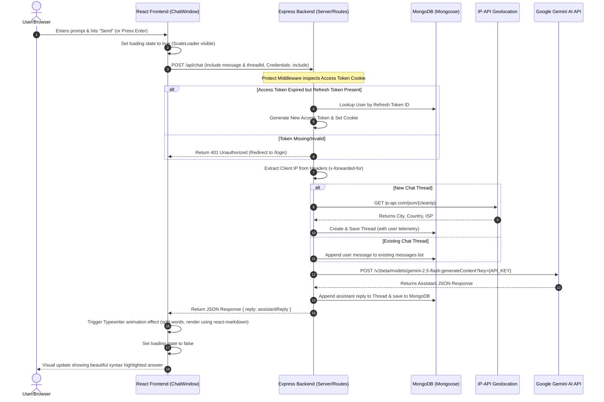

# SkyGPT - Interview Preparation & Architecture Guide

This guide is designed to help you explain the **SkyGPT** project confidently in technical interviews. It includes the system pitch, step-by-step request flow diagram, execution stages, and answers to advanced cross-questions that interviewers might ask.

---

## 1. How to Pitch the Project (The Elevator Pitch)

### 30-Second Summary
> "SkyGPT is a secure, full-stack AI chatbot platform built on the MERN stack (React, Node.js, Express, MongoDB) integrated with Google's Gemini AI. The application features a robust custom authentication system using JWTs stored in HttpOnly cookies, silent token refreshing, automated input sanitization (XSS and NoSQL injection protection), and a real-time admin telemetry CLI that tracks active user sessions including IP geolocation, ISPs, and client devices."

### 2-Minute Detail
> "I developed SkyGPT to solve two main challenges: providing a high-performance, secure chat interface with third-party integrations (Google & GitHub OAuth) and capturing live forensic telemetry for administrative auditing. 
> 
> On the **Frontend**, I used React and Vite for blazing-fast builds, and implemented a custom-styled, split-screen login page with glassmorphism layout, dynamic markdown parsing for code snippets, and typewriter streaming effects.
> 
> On the **Backend**, I built a stateless Node/Express server protected by security headers (Helmet), custom XSS filters, input validators, and rate limiters. To ensure stability against network/DNS failures during database connections, I configured a custom DNS resolver override to Google's public servers. I also created a terminal-based CLI tool, `admin_report.js`, which allows administrators to query live user activity, search topics, geolocation, and detailed chat logs directly from the cloud database without needing a web dashboard."

---

## 2. Architecture & Data Flow Diagram

The following Mermaid diagram visualizes the complete lifecycle of a user prompt, authentication validation, geolocation lookup, Gemini API call, database persistence, and UI rendering.

---

## 3. Step-by-Step System Flow (Under the Hood)

1. **User Action:** The user inputs a message in `ChatWindow.jsx` and clicks Send. The state `loading` is set to `true`, showing the `ScaleLoader` spinner.
2. **CORS Safe Transport:** A `POST` fetch request is sent to the backend `/api/chat` with `{ credentials: "include" }`. This directive tells the browser to automatically include the HTTP-only authentication cookies (`accessToken` and `refreshToken`).
3. **Session Verification (Protect Middleware):** The backend interceptor in `authMiddleware.js` verifies the incoming `accessToken` against the JWT Secret. If expired, it silently verifies the `refreshToken` from the cookie, queries MongoDB for the user, generates a new `accessToken`, writes it as a fresh cookie, and allows the request to proceed.
4. **Telemetry Extraction:** The backend pulls the client IP from `req.headers["x-forwarded-for"]` or the socket. It uses the `getLocationFromIP` utility to call the `ip-api.com` database, parsing the city, region, country, and ISP.
5. **AI Interaction:** The backend server constructs a REST POST request containing the prompt and submits it to Google Generative Language endpoints using the secret `GEMINI_API_KEY`.
6. **Mongoose Database Persistence:** Once the AI replies, the backend creates or updates a Mongoose `Thread` schema document, saving the message arrays, user agent, IP address, ISP, and location parameters.
7. **Typewriter & Markdown Parsing:** The frontend receives the JSON response. `Chat.jsx` uses a `useEffect` loop with `setInterval` to output the text word-by-word (Typewriter effect) and routes the output through `<ReactMarkdown rehypePlugins={[rehypeHighlight]}>` to render code snippets with syntax highlighting.

---

## 4. Expected Interview Cross-Questions & Answers

### Q1: Why did you use JWTs stored in HttpOnly Cookies instead of LocalStorage?
* **Answer:** "Storing JWTs in `localStorage` exposes them to Cross-Site Scripting (XSS) attacks. If an attacker injects a malicious script via a third-party package or inline code, they can execute `localStorage.getItem('token')` and steal the user session. By using **HttpOnly Cookies**, we instruct the browser that the cookie cannot be read by client-side JavaScript. This mitigates XSS token theft. To prevent CSRF (Cross-Site Request Forgery), we configure the cookie with the `SameSite=Lax` (or `None` with `Secure` in production HTTPS) attributes."

### Q2: What is the "Silent Refresh" mechanism in your project and how does it work?
* **Answer:** "To provide both high security and a seamless user experience, we use short-lived access tokens (15 minutes) and long-lived refresh tokens (7 days). 
When the short-lived access token expires, the frontend request will fail. Instead of redirecting the user to log in again, our backend `protect` middleware catches the expired access token, reads the `refreshToken` cookie, verifies it, issues a new `accessToken` cookie on the fly, and lets the request continue. The user never notices a interruption in their chat session."

### Q3: You configured `dns.setServers(['8.8.8.8', '8.8.4.4'])` in server.js. Why?
* **Answer:** "In Node.js, Mongoose connections to MongoDB Atlas clusters sometimes fail during DNS resolution because of restrictive local router DNS settings or slow ISPs. By manually overriding the resolver servers to Google's Public DNS (`8.8.8.8`), we ensure that Atlas SRV records are resolved quickly and reliably, preventing connection timeout crashes during server startup."

### Q4: How does your Geolocation tracker handle Localhost (`127.0.0.1` or `::1`) IPs?
* **Answer:** "Public geolocation APIs like `ip-api.com` fail if we send a local loopback IP like `::1` or `127.0.0.1`. In my `geo.js` utility, I normalized local IP addresses. Before making the external API request, the function checks if the IP matches localhost parameters. If it does, it returns a static fallback object: `{ ip: "::1", city: "Localhost", region: "Local", country: "Local", formatted: "Localhost (Development)" }`. This prevents lookup failures during development."

### Q5: How did you handle CORS policy issues between localhost:5173 and localhost:8080?
* **Answer:** "Since the frontend and backend run on different ports, the browser blocks request responses due to Cross-Origin Resource Sharing rules. I solved this by configuring the Express backend with the `cors` middleware, setting the `origin` property to match the frontend URL, and setting `credentials: true`. Simultaneously on the frontend, I passed the `credentials: 'include'` option inside the `fetch()` API calls so cookies could cross the origin boundary securely."

### Q6: How does the Typewriter effect in `Chat.jsx` work? Does it stream from the API?
* **Answer:** "In this version, we fetch the complete answer from the Gemini API and then simulate a typewriter effect on the frontend client-side for aesthetic smoothness. The `useEffect` hook triggers when a new reply arrives, splits the reply string into an array of words, and uses a `setInterval` running every 40ms to incrementally slice the array and join the words back together, updating the state variables until the full text is rendered."
* *Follow-up thought:* If they ask how to make it *real time*, you can mention migrating to Server-Sent Events (SSE) or WebSockets to stream chunk-by-chunk directly from the Gemini API stream content endpoints.

### Q7: Tell me about your XSS sanitization and Mongo Sanitize middleware.
* **Answer:** "React automatically escapes strings rendered in JSX, but when using markdown compilers like `react-markdown` or custom HTML rendering, XSS vectors might slip through. I implemented a custom `xssClean` middleware in the backend that recursively sanitizes strings in `req.body`, `req.query`, and `req.params` by escaping HTML characters (like `<`, `>`, and `&`). Additionally, we commented out mongoSanitize for Express 5 compatibility but we leverage Mongoose schemas which enforce strict casting, preventing NoSQL injection attacks where query operators like `$gt` could bypass password checks."

### Q8: What is the purpose of the `admin_report.js` script?
* **Answer:** "It is an administrative Command Line Interface (CLI) utility. It allows developers or admins with terminal access to inspect live user sessions directly from MongoDB. Running `node admin_report.js` returns a clean ASCII table of the top 20 latest chats, user emails, queries, and geographic locations. Running `node admin_report.js <email>` queries details for that specific user, printing their full profile details along with their complete chat histories and forensics telemetry."

---
This guide covers the core architectural strengths of your project. Read it over to prepare for any technical discussions about your codebase!
